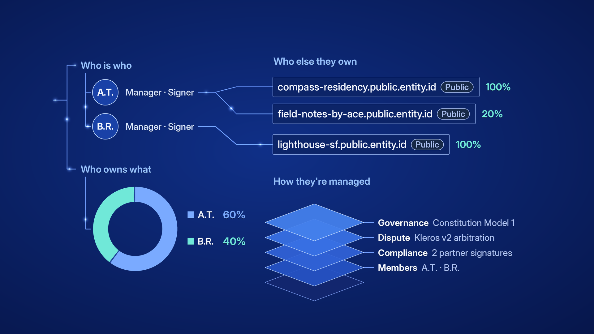
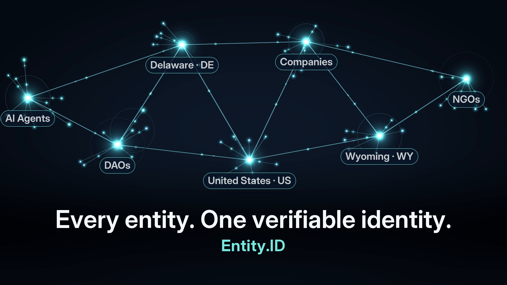

# Entity.ID conference booth loop

Background videos for the Entity.ID conference booth: play on loop in fullscreen behind the booth.

Entity.ID is **The Universal Verified Facts Identifier** for companies, NGOs, DAOs, AI agents, and jurisdictions.

## v4 (recommended)

A **50 second**, **seamless**, **silent** **1920×1080** loop in the style of the deck’s **“Universal Verified Facts Entity.ID”** slide: real Entity.IDs are shown, and each one opens into its verified facts. All facts come from Entity.ID records; people are shown as **initials only**.



| File | Role |
|------|------|
| [`entityid-booth/entityid-booth-loop-v4-1080p.mp4`](entityid-booth/entityid-booth-loop-v4-1080p.mp4) | Booth playback master (~13.6 MB) |
| [`entityid-booth/entityid-booth-loop-v4-720p.mp4`](entityid-booth/entityid-booth-loop-v4-720p.mp4) | Lighter preview copy (~8.4 MB) |
| [`entityid-booth/poster-v4.png`](entityid-booth/poster-v4.png) | Title-frame still |
| [`entityid-booth/src/build_loop_v4.py`](entityid-booth/src/build_loop_v4.py) | Render script |

**SHA-256 (1080p):** `95b5f02e6c7f23792402561fcefe6d86c31de8e60c96f442e4eb6eeea6803a64`

### Scene list (v4, in order)

1. Real IDs flow along a vertical spine, grouped by type and jurisdiction.
2. The AI agent **speak5.ai.entity.id** branches into **Know-Your-Agent** (owner KYC verified, owner signature, constitution), **Attribution** (same owner as speak5.public.entity.id), and **Who is who**.
3. The company **northstar-growth.public.entity.id** branches into **Who is who** (two partners shown as initials), **Who owns what** (60/40 equity), the other entities those partners own, and **How they’re managed** (members, compliance, Kleros v2 disputes, constitution governance).
4. The corporate group **the-lauridsen-group-inc.us-ia.entity.id** fans out to its 8 subsidiaries across Iowa, Nebraska, and Denmark.
5. Stats (2,935,661 registered entities, 311 active jurisdictions, 226,467 verifiable entities), **“Every entity. One verifiable identity.”**, then the CTA **“Get your ID → app.entity.id”** with a QR code to [https://app.entity.id](https://app.entity.id).

### Playback (v4)

```bash
mpv --loop=inf --fs entityid-booth/entityid-booth-loop-v4-1080p.mp4
```

In **VLC**, open the v4 1080p file and enable **Repeat** (loop), then fullscreen.

### Re-render (v4)

With [ffmpeg](https://ffmpeg.org/), [Pillow](https://python-pillow.org/), [numpy](https://numpy.org/), and [qrcode](https://pypi.org/project/qrcode/) installed, and the **Inter** font on your system:

```bash
python entityid-booth/src/build_loop_v4.py
```

---

## v3 (previous version)

A **40 second**, **seamless**, **silent** **1920×1080** loop with network hubs, stats, taglines, and CTA.



| File | Role |
|------|------|
| [`entityid-booth/entityid-booth-loop-v3-1080p.mp4`](entityid-booth/entityid-booth-loop-v3-1080p.mp4) | Booth playback master (~49.5 MB, 30 fps, no audio) |
| [`entityid-booth/entityid-booth-loop-v3-720p.mp4`](entityid-booth/entityid-booth-loop-v3-720p.mp4) | Lighter preview copy (~6.7 MB) |
| [`entityid-booth/poster.png`](entityid-booth/poster.png) | Title-frame still |
| [`entityid-booth/src/build_loop_v3.py`](entityid-booth/src/build_loop_v3.py) | Render script |

**SHA-256 (1080p):** `925e940f410044a66e1ba52d2d4706e3166d4c38b8937e3b5d611278dc339f4b`

### Scene list (v3, in order)

1. **Network hubs** with real entity IDs: AI Agents and DAOs; Delaware (DE) and Companies; Wyoming (WY) and NGOs; United States (US).
2. **Stats** (from [entity.id](https://entity.id)): 2,935,661 registered entities; 311 active jurisdictions; 226,467 verifiable entities.
3. **Tagline:** Unified · Verifiable · Interoperable
4. **Title:** “Every entity. One verifiable identity.” with **Entity.ID**
5. **CTA:** “Get your ID → app.entity.id” with a QR code to [https://app.entity.id](https://app.entity.id)

```bash
mpv --loop=inf --fs entityid-booth/entityid-booth-loop-v3-1080p.mp4
```

```bash
python entityid-booth/src/build_loop_v3.py
```
